# Lumen Programming Language: Complete Technical Reference

## Table of Contents
1. [Architecture Overview](#1-architecture-overview)
2. [Compiler Pipeline](#2-compiler-pipeline)
3. [VM & Runtime Architecture](#3-vm--runtime-architecture)
4. [Full Execution Flow](#4-full-execution-flow)
5. [LIR Bytecode & Instruction Encoding](#5-lir-bytecode--instruction-encoding)
6. [Effect System](#6-effect-system)
7. [Type System](#7-type-system)
8. [Tool System](#8-tool-system)
9. [CLI & Package Management](#9-cli--package-management)
10. [Module Dependencies](#10-module-dependencies)
11. [Key Algorithms & Data Structures](#11-key-algorithms--data-structures)

---

## 1. Architecture Overview

### 1.1 Workspace Structure

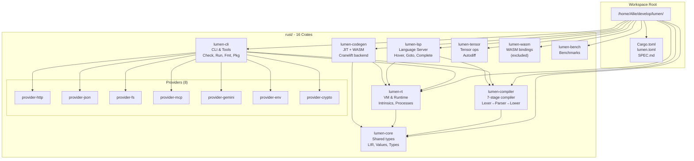

### 1.2 Directory Tree

```
/home/Allie/develop/lumen/
├── Cargo.toml                    # Workspace root
├── lumen.toml                    # Runtime config
├── SPEC.md                       # Language specification
├── CLAUDE.md                     # AI agent guidance
├── AGENTS.md                     # Crate-specific docs
│
├── rust/
│   ├── lumen-core/src/
│   │   ├── lir.rs                # LIR bytecode, opcodes, instruction encoding
│   │   ├── values.rs             # Value enum (runtime values)
│   │   ├── strings.rs            # String interning
│   │   └── types.rs              # Type definitions
│   │
│   ├── lumen-compiler/src/
│   │   ├── lib.rs                # Entry point, pipeline orchestration
│   │   ├── markdown/extract.rs   # Code block extraction
│   │   └── compiler/
│   │       ├── lexer.rs           # Indentation-aware tokenizer
│   │       ├── parser.rs          # Recursive descent + Pratt parsing
│   │       ├── ast.rs            # AST node definitions
│   │       ├── resolve.rs         # Name resolution, symbol table
│   │       ├── typecheck.rs       # Bidirectional type inference
│   │       ├── constraints.rs     # Record where-clause validation
│   │       ├── lower.rs           # AST → LIR bytecode
│   │       └── [many more...]
│   │
│   ├── lumen-rt/src/
│   │   ├── lib.rs
│   │   ├── vm/
│   │   │   ├── mod.rs            # VM core, dispatch loop
│   │   │   ├── intrinsics.rs     # 140+ builtin functions
│   │   │   ├── ops.rs            # Arithmetic operations
│   │   │   ├── processes.rs      # Memory/Machine/Pipeline runtimes
│   │   │   └── continuations.rs  # Multi-shot continuations
│   │   └── services/
│   │       ├── tools.rs           # Tool dispatch, provider registry
│   │       ├── scheduler.rs       # M:N work-stealing scheduler
│   │       └── [many more...]
│   │
│   ├── lumen-cli/src/
│   │   ├── bin/lumen.rs          # CLI entry with Clap
│   │   ├── module_resolver.rs    # Import resolution
│   │   ├── repl.rs               # Interactive REPL
│   │   ├── fmt.rs                # Code formatter
│   │   ├── wares/                # Package manager
│   │   ├── auth.rs               # Ed25519 signing
│   │   ├── tuf.rs                # TUF metadata verification
│   │   └── [many more...]
│   │
│   ├── lumen-lsp/src/            # LSP implementation
│   ├── lumen-codegen/src/        # Cranelift JIT
│   └── lumen-provider-*/         # Tool providers
│
├── docs/                         # Documentation
├── examples/                     # 30 example programs
├── stdlib/                       # Standard library
├── tree-sitter-lumen/           # Tree-sitter grammar
└── editors/vscode/              # VS Code extension
```

---

## 2. Compiler Pipeline

### 2.1 Seven-Stage Pipeline

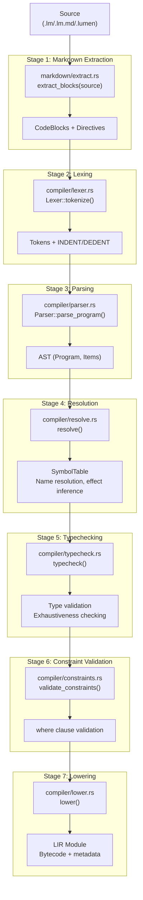

### 2.2 Compiler Entry Points

| Function | Location | Purpose |
|----------|----------|---------|
| `compile(source)` | `lib.rs:781` | Main entry for `.lm.md`/`.lumen` |
| `compile_raw(source)` | `lib.rs:726` | Raw `.lm` files |
| `compile_with_options(source, opts)` | `lib.rs:786` | With compile options |
| `compile_with_imports(source, resolver)` | `lib.rs:214` | Multi-file compilation |

### 2.3 Key Compiler Files

| File | Lines | Purpose |
|------|-------|---------|
| `compiler/parser.rs` | ~8,100 | Recursive descent + Pratt parsing |
| `compiler/lower.rs` | ~6,700 | AST → LIR bytecode |
| `compiler/resolve.rs` | ~4,800 | Name resolution, symbol table |
| `compiler/typecheck.rs` | ~2,900 | Bidirectional type inference |
| `compiler/lexer.rs` | ~1,800 | Indentation-aware tokenizer |
| `compiler/ast.rs` | ~1,000 | AST node definitions |
| `markdown/extract.rs` | ~500 | Code block extraction |

---

## 3. VM & Runtime Architecture

### 3.1 Value Representation

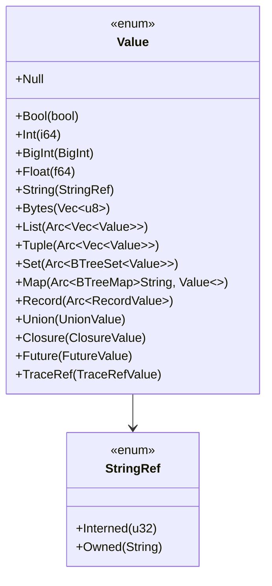

**Design Decisions:**
- **Scalar variants**: Stack-allocated, no heap indirection
- **Collection variants**: `Arc<T>`-wrapped for COW semantics
- **Sets**: `BTreeSet<Value>` for O(log n) membership
- **String interning**: `StringRef::Interned(u32)` vs `Owned(String)`

### 3.2 VM Core Components

```mermaid
flowchart TB
    subgraph "VM Core (vm/mod.rs)"
        DISP["run_until()<br/>Dispatch Loop"]
        REG["Register File<br/>Vec~Value~"]
        FRAMES["Call Frame Stack<br/>Vec~CallFrame~"]
        EH["Effect Handler Stack<br/>Vec~EffectScope~"]
        SC["SuspendedContinuation<br/>Option~SuspendedContinuation~"]
    end
    
    subgraph "CallFrame"
        CF1["cell_idx: usize"]
        CF2["base_register: usize"]
        CF3["ip: usize"]
        CF4["return_register: usize"]
    end
    
    subgraph "Intrinsics (intrinsics.rs)"
        INT1["Core: print, debug, clone"]
        INT2["String: length, upper, split"]
        INT3["Math: abs, sqrt, sin"]
        INT4["Collection: map, filter, reduce"]
        INT5["File I/O: read_file, write_file"]
        INT6["HTTP: http_get, http_post"]
    end
    
    subgraph "Process Runtimes (processes.rs)"
        MEM["MemoryRuntime<br/>entries, kv store"]
        MACH["MachineRuntime<br/>state graph"]
        PIP["PipelineRuntime<br/>stage chaining"]
    end
    
    DISP --> REG
    DISP --> FRAMES
    DISP --> EH
    DISP --> SC
    FRAMES --> CF1
    FRAMES --> CF2
    FRAMES --> CF3
    FRAMES --> CF4
    DISP --> INT1
    DISP --> INT2
    DISP --> INT3
    DISP --> INT4
    DISP --> INT5
    DISP --> INT6
    DISP --> MEM
    DISP --> MACH
    DISP --> PIP
```

### 3.3 Dispatch Loop (run_until)

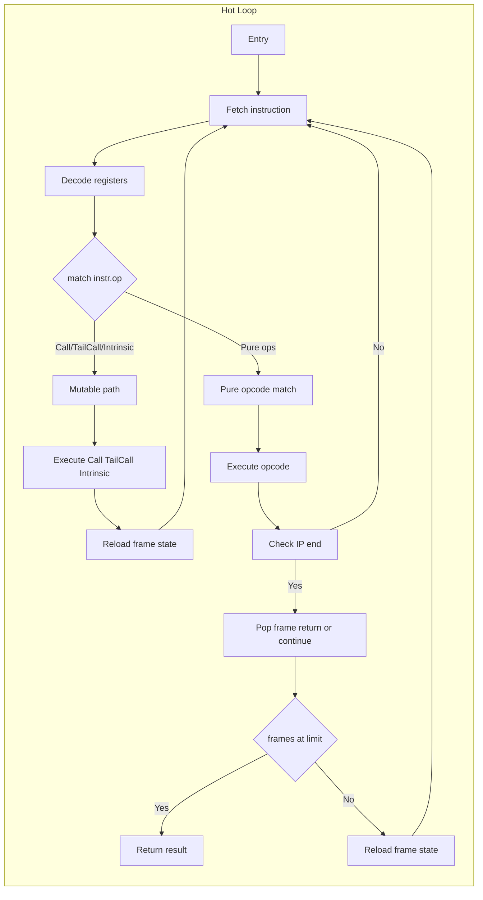

**Key Optimizations:**
- Raw pointer caching for module access
- Local variable caching for frame state
- Batch instruction counting (4096 per sync)
- Pre-branch hints for debug/fuel checks

---

## 4. Full Execution Flow

### 4.1 From lumen run to Result

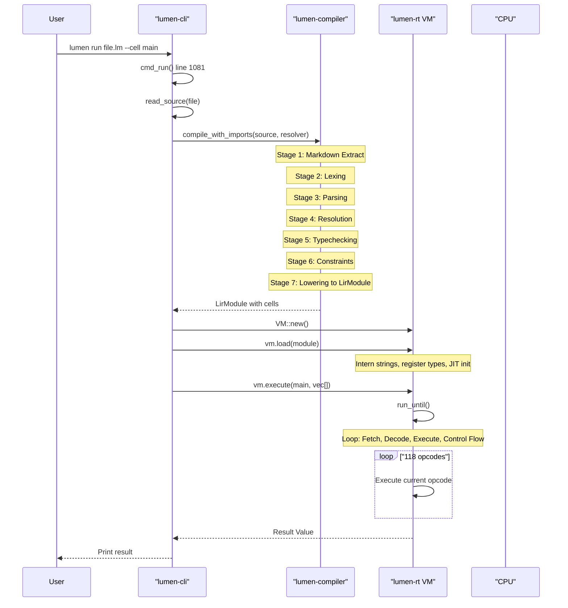

### 4.2 Cell Call Cycle

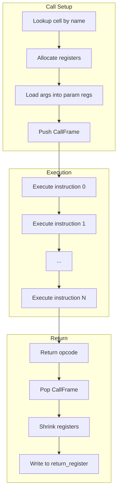

---

## 5. LIR Bytecode & Instruction Encoding

### 5.1 Instruction Format (64-bit Fixed Width)

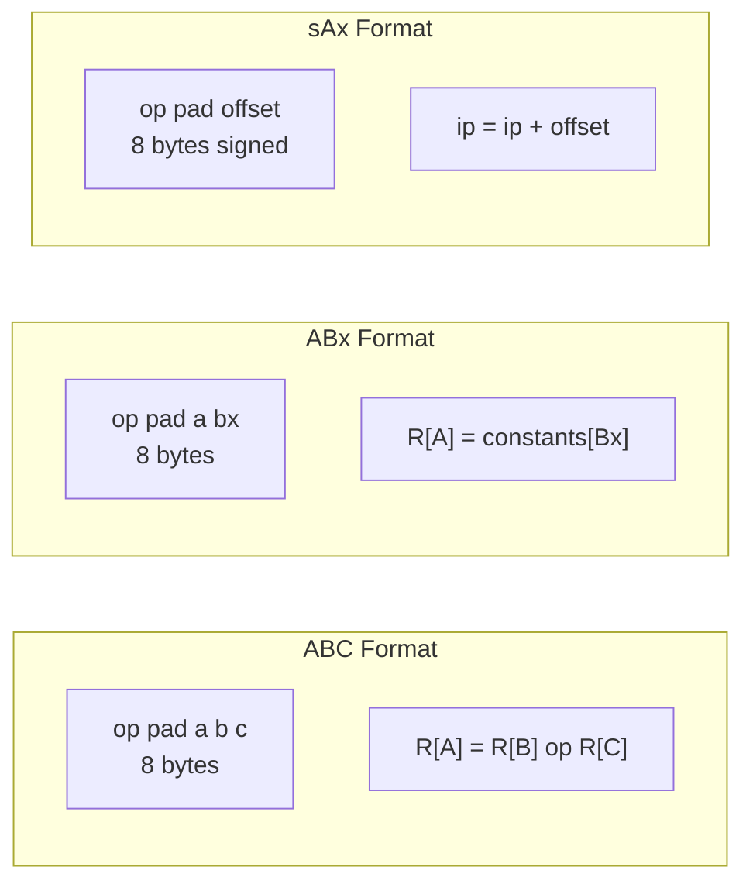

### 5.2 Byte Layout

```
Byte:    [  0  ] [  1  ] [  2-3   ] [ 4-5   ] [ 6-7   ]
Field:     op      pad       a          b          c
Bits:      8       8       16         16         16
Total:    64 bits (8 bytes)

For ABx format:
  bx = (b << 16) | c  → 32-bit constant index

For sAx format (jumps):
  offset = sign_extend((a << 32) | (b << 16) | c)  → 48-bit signed
```

### 5.3 Opcode Categories

| Category | Opcodes | Count |
|----------|---------|-------|
| **Load/Move** | LoadK, LoadNil, LoadBool, LoadInt, Move, MoveOwn | 6 |
| **Data Construction** | NewList, NewMap, NewRecord, NewUnion, NewTuple, NewSet | 6 |
| **Access** | GetField, SetField, GetIndex, SetIndex, GetTuple | 5 |
| **Arithmetic** | Add, Sub, Mul, Div, FloorDiv, Mod, Pow, Neg, Concat | 9 |
| **Bitwise** | BitOr, BitAnd, BitXor, BitNot, Shl, Shr | 6 |
| **Comparison** | Eq, Lt, Le, Not, And, Or, In, Is, NullCo, Test | 10 |
| **Control Flow** | Jmp, Call, TailCall, Return, Halt, Loop, ForPrep, ForLoop, Break, Continue | 10 |
| **Effects** | Perform, HandlePush, HandlePop, Resume | 4 |
| **Async** | Await, Spawn | 2 |
| **Intrinsics** | Intrinsic (140+ builtins) | 1 |
| **Closures** | Closure, GetUpval, SetUpval | 3 |
| **Tools** | ToolCall, Schema, Emit, TraceRef | 4 |

### 5.4 Critical Gotchas

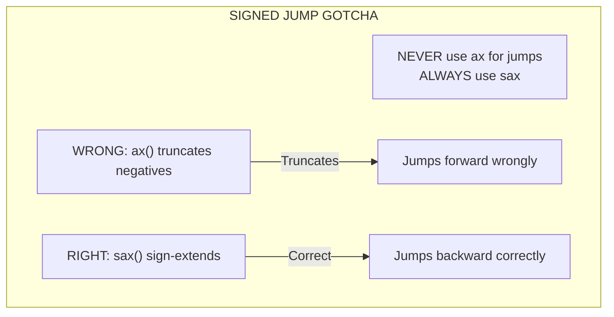

**Why it matters:**
- `ax_val()` returns unsigned 48-bit value
- `sax_val()` sign-extends from bit 47
- Backward jumps (loops) have negative offsets
- Using unsigned will cause loops to jump forward → infinite loop or crash

---

## 6. Effect System

### 6.1 Effect Declaration & Usage

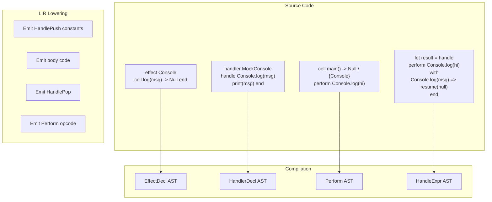

### 6.2 Effect Handler Stack

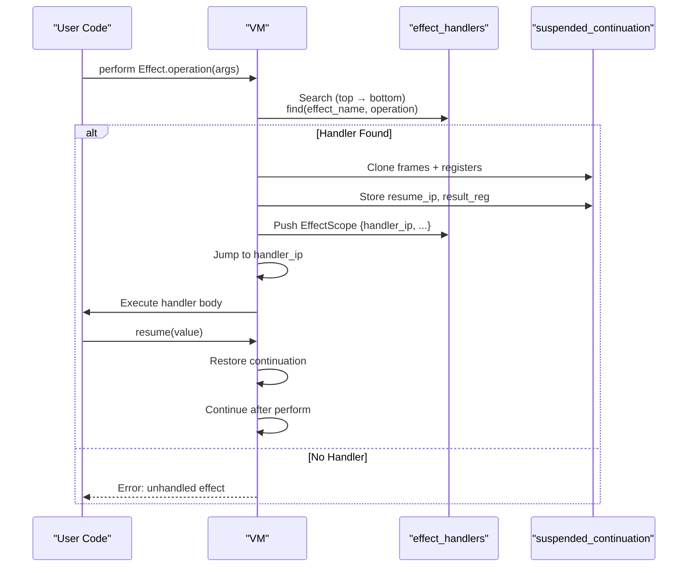

### 6.3 Effect Opcodes

| Opcode | Operation | Description |
|--------|-----------|-------------|
| `HandlePush` | Push handler scope | Install effect handler on stack |
| `HandlePop` | Pop handler scope | Remove effect handler |
| `Perform` | Execute effect | Find handler, save continuation, jump |
| `Resume` | Continue computation | Restore continuation with value |

### 6.4 Effect Scope Structure

```rust
pub(crate) struct EffectScope {
    pub handler_ip: usize,        // Where handler code starts
    pub frame_idx: usize,         // Frame when handler was pushed
    pub base_register: usize,    // Register base for frame
    pub cell_idx: usize,         // Cell containing handler
    pub effect_name: String,     // "Console", "http", etc.
    pub operation: String,       // "log", "get", etc.
}

pub(crate) struct SuspendedContinuation {
    pub frames: Vec<CallFrame>,      // Stack at suspension
    pub registers: Vec<Value>,        // Registers at suspension
    pub resume_ip: usize,            // Where to continue
    pub resume_frame_count: usize,   // Frames to restore
    pub result_reg: usize,           // Where resume value goes
}
```

---

## 7. Type System

### 7.1 Type Variants

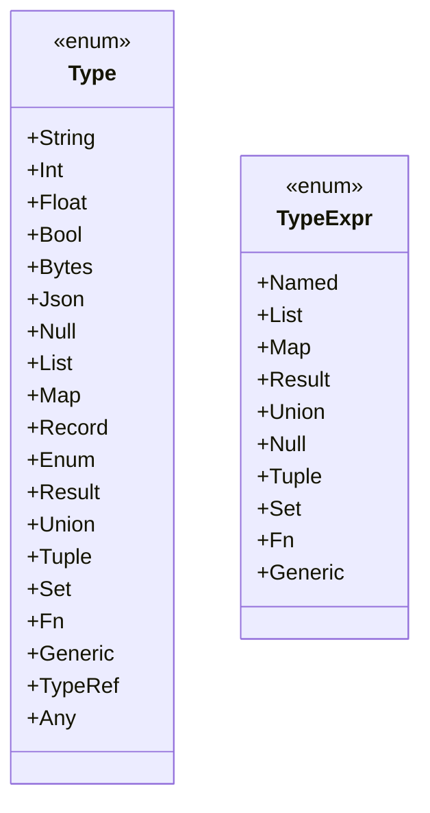

### 7.2 Type Inference Flow

```mermaid
flowchart TB
    subgraph "Inference Mode"
        INF1["infer_expr returns Type"]
        INF2["Literal infers type"]
        INF3["Identifier lookup"]
        INF4["List infers element type"]
    end
    
    subgraph "Checking Mode"
        CHK1["check_compat expected actual"]
        CHK2["exact match"]
        CHK3["Int to Float implicit"]
        CHK4["Null in union"]
        CHK5["union member match"]
    end
    
    subgraph "Generic Inference"
        GEN1["unify for inference"]
        GEN2["build substitution"]
        GEN3["resolve with subst"]
    end
    
    subgraph "Match Exhaustiveness"
        EXH1["track covered variants"]
        EXH2["has catchall"]
        EXH3["report error if missing"]
    end
    
    INF1 --> INF2
    INF1 --> INF3
    INF1 --> INF4
    
    CHK1 --> CHK2
    CHK2 --> |No| CHK3
    CHK3 --> CHK4
    CHK4 --> CHK5
    
    GEN1 --> GEN2
    GEN2 --> GEN3
    
    EXH1 --> EXH2
    EXH2 --> |No| EXH3
```

### 7.3 Type Sugar

| Syntax | Desugars To | Example |
|--------|-------------|---------|
| `T?` | `T \| Null` | `Int?` → `Int \| Null` |
| `list[T]` | `List(Box<Type>)` | `list[Int]` |
| `map[K, V]` | `Map(K, V)` | `map[String, Int]` |
| `set[T]` | `Set(T)` | `set[Int]` |
| `result[T, E]` | `Result(T, E)` | `result[Int, String]` |

---

## 8. Tool System

### 8.1 Tool Declaration & Usage

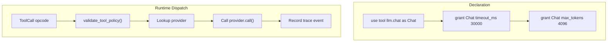

### 8.2 Provider Registry

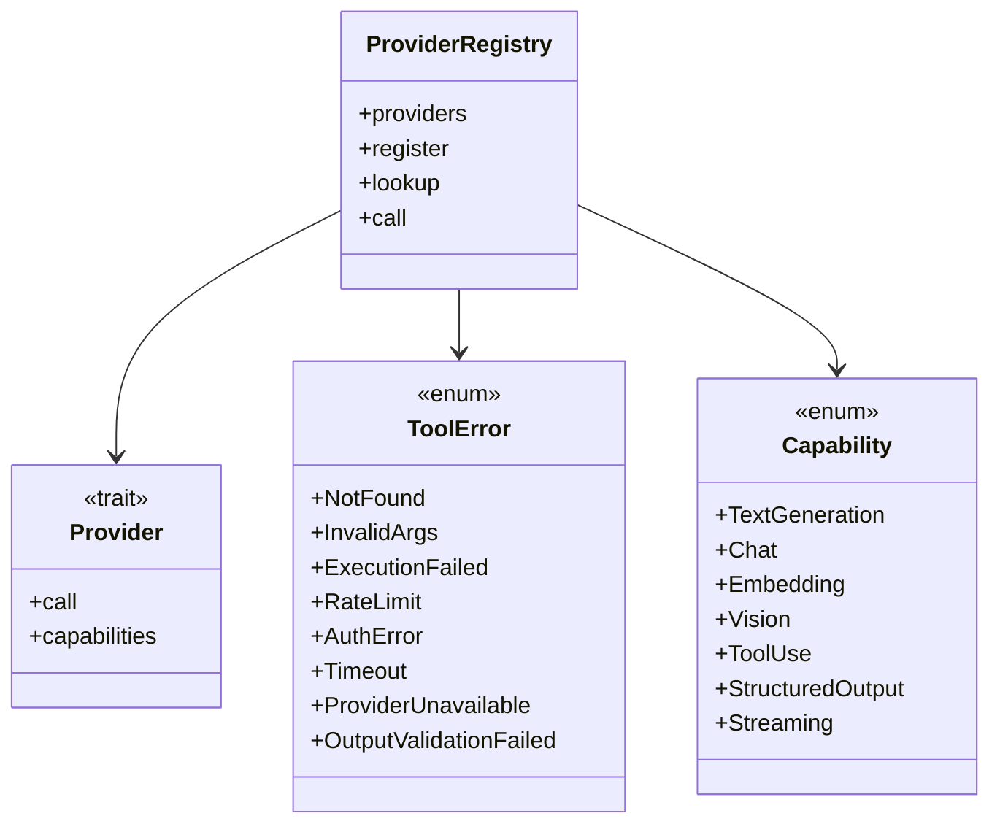

### 8.3 Built-in Providers

| Provider | Tools |
|----------|-------|
| **fs** | fs.read, fs.write, fs.exists, fs.list, fs.mkdir, fs.remove |
| **env** | env.get, env.set, env.list, env.has, env.cwd, env.home |
| **json** | json.parse, json.stringify |
| **crypto** | crypto.sha256, crypto.sha512, crypto.md5, crypto.base64_encode, crypto.base64_decode, crypto.uuid, crypto.random_int, crypto.hmac_sha256 |
| **http** | http.get, http.post, http.put, http.delete |
| **gemini** | gemini.generate, gemini.chat, gemini.embed (if configured) |

---

## 9. CLI & Package Management

### 9.1 CLI Commands

```mermaid
graph TB
    CLI["lumen CLI"]
    
    CHECK["check"]
    RUN["run"]
    EMIT["emit"]
    FMT["fmt"]
    TEST["test"]
    LINT["lint"]
    DOC["doc"]
    REPL["repl"]
    TRACE["trace"]
    CACHE["cache"]
    BUILD["build"]
    MIGRATE["migrate"]
    DEBUG["debug"]
    
    WARES_INIT["wares init"]
    WARES_BUILD["wares build"]
    WARES_ADD["wares add"]
    WARES_REMOVE["wares remove"]
    WARES_PUBLISH["wares publish"]
    
    CLI --> CHECK
    CLI --> RUN
    CLI --> EMIT
    CLI --> FMT
    CLI --> TEST
    CLI --> LINT
    CLI --> DOC
    CLI --> REPL
    CLI --> TRACE
    CLI --> CACHE
    CLI --> BUILD
    CLI --> MIGRATE
    CLI --> DEBUG
    
    CLI --> WARES_INIT
    CLI --> WARES_BUILD
    CLI --> WARES_ADD
    CLI --> WARES_REMOVE
    CLI --> WARES_PUBLISH
```

### 9.2 Module Resolution

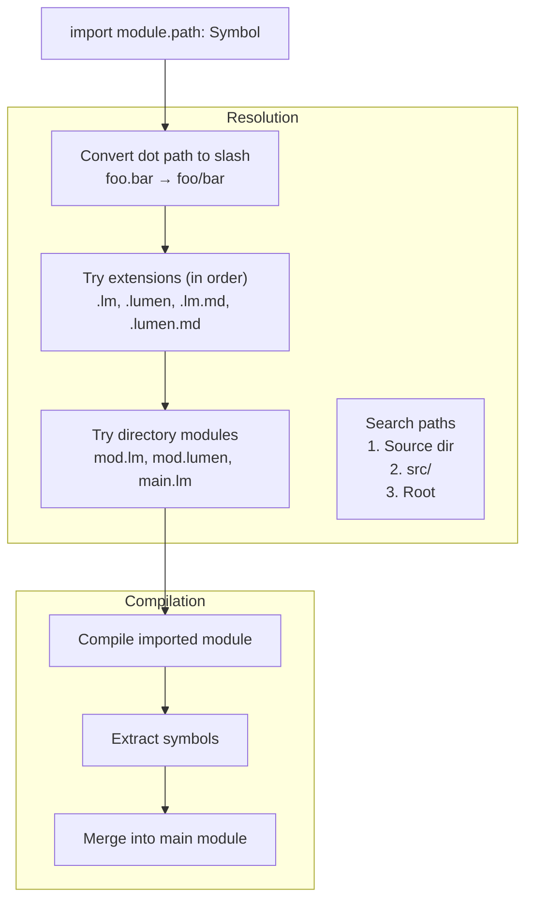

### 9.3 Package Manager (Wares)

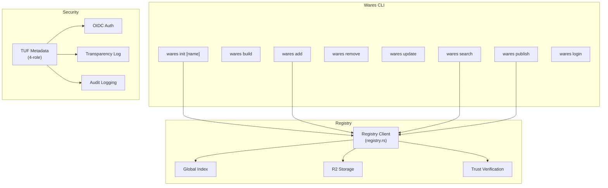

---

## 10. Module Dependencies

### 10.1 Crate Dependency Graph

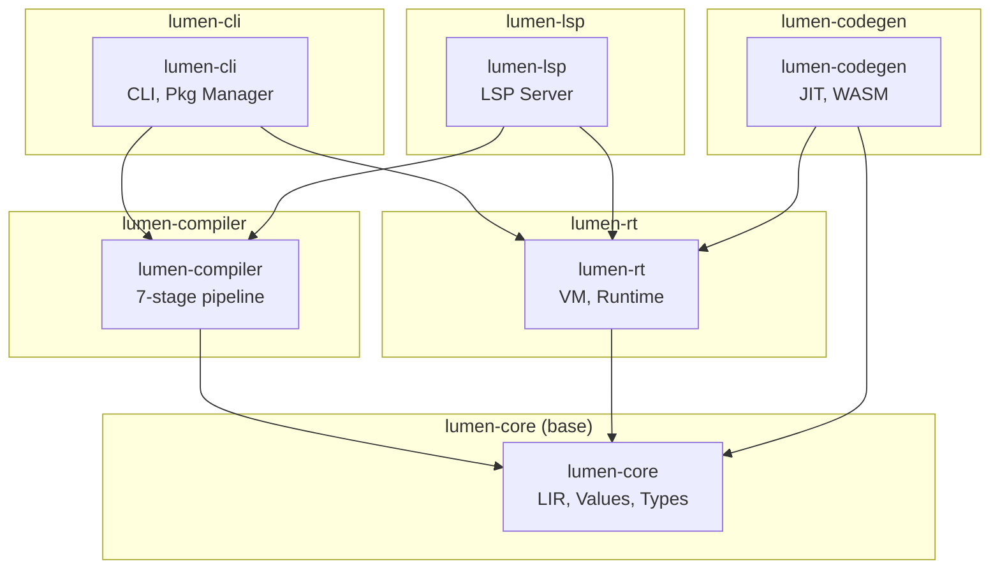

### 10.2 Data Flow Between Components

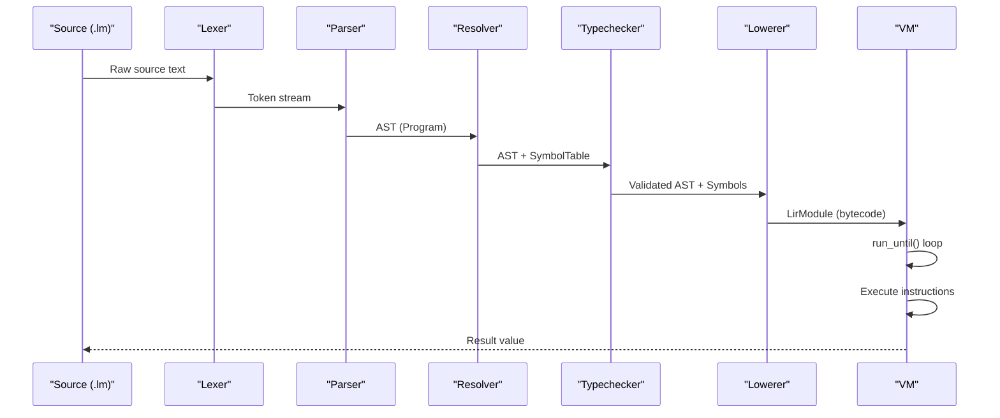

---

## 11. Key Algorithms & Data Structures

### 11.1 Register Allocation

```mermaid
flowchart TB
    subgraph "Compile Time"
        C1["Analyze cell body"]
        C2["Count max registers needed"]
        C3["Emit instructions with reg indices"]
    end
    
    subgraph "Runtime"
        R1["Pre-allocate Vec Value capacity 4096"]
        R2["grow_registers returns base index"]
        R3["Write to registers base plus reg"]
        R4["shrink_registers on return"]
    end
    
    C1 --> C2
    C2 --> C3
    
    R1 --> R2
    R2 --> R3
    R3 --> R4
```

### 11.2 String Interning

```mermaid
classDiagram
    class StringTable {
        +interned
        +indexes
        +intern
        +lookup
        +get_interned
    }
    
    class StringRef {
        <<enum>>
        +Interned
        +Owned
    }
    
    StringTable --> StringRef
```

### 11.3 Copy-on-Write Collections

```mermaid
flowchart TB
    subgraph "Mutation"
        M1["Get collection via Arc"]
        M2["Arc make_mut"]
        M3{"Unique?"}
        M4["Clone on write"]
    end
    
    M1 --> M2
    M2 --> M3
    M3 --> |Yes| M5["Mutate in place"]
    M3 --> |No| M4
    
    M4 --> M5
```

---

## Summary

The Lumen programming language is a sophisticated AI-native systems language with:

- **7-stage compiler pipeline**: Markdown extraction → Lexer → Parser → Resolver → Typechecker → Constraints → Lowering
- **Register-based VM**: 64-bit fixed-width instructions, 118 opcodes, watermark-based register allocation
- **Full type system**: Primitives, generics, unions, optionals, bidirectional inference
- **Algebraic effects**: One-shot delimited continuations with handler stack
- **Tool system**: Provider registry, policy enforcement, 140+ builtins
- **Package manager**: Wares with TUF security, OIDC auth, transparency logs
- **Complete tooling**: CLI, REPL, formatter, LSP, debug adapter

The execution flow is: **Source → Compile → LIR → VM Load → Execute → Result**
