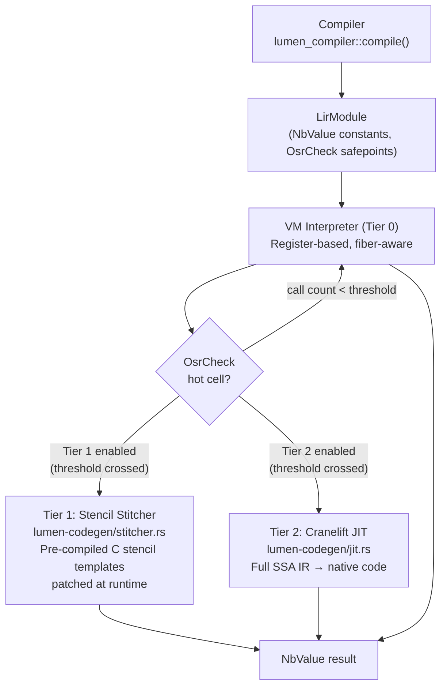
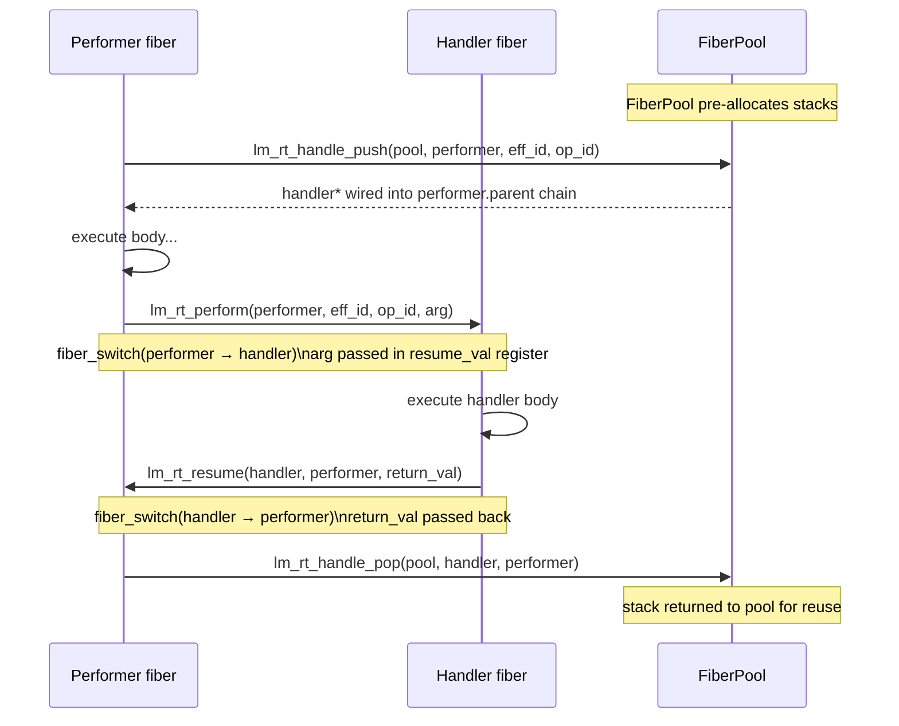

# Architecture

## High-Level Components

- `lumen-cli`: user-facing entrypoint.
- `lumen-compiler`: front-end and lowering pipeline.
- `lumen-core`: shared value types (`Value`, `NbValue`, `LirModule`), LIR definitions.
- `lumen-rt`: runtime — VM interpreter, fiber-based effect system, 3-tier JIT integration.
- `lumen-codegen`: JIT/AOT backends (Cranelift, stencils, OrcJIT).
- `lumen-runtime`: tool dispatch, trace event storage, retry policy.

## Compiler Pipeline


Seven sequential stages:

1. **Markdown extraction** — pulls fenced `lumen` code blocks from `.lm.md` / `.lumen` files.
2. **Lexing** — tokenises concatenated source blocks.
3. **Parsing** — produces `Program` AST (`ast.rs` defines all node types).
4. **Resolution** — builds symbol table; infers and validates effect rows.
5. **Typechecking** — validates types, patterns, and record field constraints.
6. **Constraint validation** — checks `where` clauses on record fields.
7. **Lowering** — converts AST to `LirModule` with NbValue-typed constants and `OsrCheck` safepoints.

## Value Representation — NaN-Boxing (`NbValue`)

All VM registers and call frames use the NaN-boxed 64-bit value type `NbValue` (`lumen-core/src/nb_value.rs`).

```
 63        48 47   32 31              0
 ┌──────────┬───────┬─────────────────┐
 │ Exponent │  Tag  │    Payload      │
 │  all 1s  │ 0-7   │ (32 or 48 bit) │
 └──────────┴───────┴─────────────────┘

Tag  Value kind      Payload
────────────────────────────────────────────
 0   IEEE float      raw f64 bits (non-NaN)
 1   SMI integer     i32 sign-extended
 2   Bool            0=false, 1=true
 3   Null/undefined  always 0
 4   Heap ptr        48-bit Arc<Value> ptr
 5   String ptr      48-bit Arc<str> ptr
 6   (reserved)
 7   NaN sentinel    used by runtime stubs
```

The legacy `Value` enum (used by the interpreter and tool dispatch) is wrapped by `NbValue`
via `to_nb` / `from_nb` conversion helpers. SMI fast-paths in arithmetic ops avoid the
conversion entirely, keeping hot loops allocation-free.

## Runtime Architecture — 3-Tier JIT



### Tier 0 — Interpreter

- Register-based dispatch loop in `lumen-rt/src/vm/mod.rs`.
- All VM registers are `NbValue` (64-bit NaN-boxed).
- Falls back to `Value` (the legacy enum) only for tool dispatch, process runtimes, and effects.
- **Always correct** — all opcodes supported, including algebraic effects and multi-shot continuations.

### Tier 1 — Stencil Stitcher

- Pre-compiled C stencil templates for arithmetic, load, and control-flow opcodes (see `lumen-codegen/src/stencils.rs`).
- `Stitcher` (`lumen-codegen/src/stitcher.rs`) patches relocations and links stencils into executable code at runtime.
- Much lower compilation latency than Cranelift — compiles instantly by copying and patching template bytes.
- Enabled via `vm.enable_stencil_with_config(StencilTierConfig::from_threshold(N))`.

### Tier 2 — Cranelift JIT

- Full SSA IR generation from LIR (`lumen-codegen/src/ir.rs`) → Cranelift IR → native code.
- Hot-cell-only compilation: only cells that cross the call-count threshold are compiled.
- Uncompilable opcodes (effects, tool calls) emit deopt stubs that fall back to the interpreter.
- Enabled via `vm.enable_jit(threshold)`.

### OSR (On-Stack Replacement)

- `OsrCheck` opcode inserted at loop back-edges by the compiler (task #24).
- When triggered, the VM snapshot (registers, call stack) is transferred into the JIT frame.
- Allows a running interpreted loop to transition to native code mid-execution without restarting.
- Implementation: `lumen-rt/src/vm/osr.rs`, `lumen-codegen/src/stackmap.rs`.

## Fiber-Based Effect System

Algebraic effects use OS-level fiber context switching for zero-allocation perform/resume:



### Key Types

| Type | File | Role |
|------|------|------|
| `Fiber` | `vm/fiber.rs` | Represents a suspended execution context (stack + registers + status) |
| `FiberPool` | `vm/fiber.rs` | Pool of pre-allocated stacks for reuse across perform/resume cycles |
| `FiberStatus` | `vm/fiber.rs` | `Idle` / `Running` / `Suspended` / `Dead` |
| `VmContext` | `lumen-core/src/vm_context.rs` | `#[repr(C)]` context passed to stencil/JIT code |

### Assembly Context Switch

`fiber_switch(current, target, resume_val) -> u64` is implemented in architecture-specific assembly:
- `x86_64`: saves/restores RBX, RBP, R12–R15, RSP; passes resume_val in RAX.
- `aarch64`: saves/restores X19–X29, SP; passes resume_val in X0.

The switch is cooperative — the fiber suspends itself by calling `fiber_switch`; the kernel is never involved. This gives sub-100 ns effect dispatch on modern hardware (target: <30 ns).

## Optimization Passes (`lumen-codegen/src/opt.rs`)

Applied to each `LirCell` before JIT/AOT lowering:

1. **Nop removal** — eliminates `Nop` instructions and adjusts all jump offsets.
2. **Escape analysis** — `NewList`/`NewTuple` whose result doesn't leave the cell (not returned, not passed to calls, not stored in upvalues) are promoted to `NewListStack`/`NewTupleStack` (stack allocation, no heap Arc).
3. **Effect specialization analysis** — identifies `Perform` operations whose handler is statically visible in the same cell (same `HandlePush`/`HandlePop` scope). Full inlining deferred pending a `CallInternal` LIR opcode.
4. **Monomorphic inline cache (MIC) analysis** — `analyze_tool_call_mic()` extracts per-callsite tool name hints. JIT backends use these to emit a fast-path direct dispatch (compare tool ID tag → call cached function pointer) before falling back to the full registry lookup.

## LIR Instruction Set

LIR uses 32-bit fixed-width instructions (Lua-style encoding):

```
 31       24 23     16 15      8 7       0
 ┌──────────┬─────────┬─────────┬────────┐
 │   Bx/Ax  │    C    │    B    │   A    │  ABC format
 └──────────┴─────────┴─────────┴────────┘
 ┌──────────────────────────────┬────────┐
 │            Bx (16-bit)       │   A    │  ABx format
 └──────────────────────────────┴────────┘
 ┌──────────────────────────────────────┐
 │          sAx (signed 24-bit)         │  sAx format (jumps)
 └──────────────────────────────────────┘
```

Key opcode families: `LoadInt` / `LoadFloat` / `LoadConst` / `Move`, arithmetic (`Add` / `Sub` / `Mul` / `Div` / `Mod`), comparison (`Eq` / `Lt` / `Le`), control flow (`Jmp` / `Test` / `ForPrep` / `ForLoop`), collections (`NewList` / `NewListStack` / `Append` / `GetIndex` / `SetIndex`), closures (`Closure` / `GetUpval` / `SetUpval`), effects (`Perform` / `HandlePush` / `HandlePop` / `Resume`), JIT hooks (`OsrCheck`).

**Signed jump offsets**: All jump opcodes (`Jmp`, `Break`, `Continue`, `HandlePush`) use `sAx` format with signed 24-bit offsets. Use `Instruction::sax(op, offset)` and `sax_val() -> i64`. Never use `ax`/`ax_val` for jumps.

## Testing Strategy

- `cargo test -p lumen-compiler` — unit tests for parser / resolver / typechecker / lowerer.
- `cargo test -p lumen-rt --test tier_parity` — cross-tier parity tests: 37 cases verify Tier 0 / Tier 1 / Tier 2 produce identical `NbValue` results for the same LIR program.
- `cargo test -p lumen-rt --test osr_transition` — OSR state transfer correctness tests.
- `rust/lumen-compiler/tests/spec_markdown_sweep.rs` — compiles every code block in `SPEC.md`.
- `rust/lumen-compiler/tests/spec_suite.rs` — semantic compile-ok / compile-err cases.
- **Total**: ~5,300+ passing tests, ~22 ignored (external services: Gemini API, MCP servers).

---

## v0.5.0 New Subsystems (Waves 19–26)

### Verification Subsystem

- SMT solver abstraction layer (`rust/lumen-compiler/src/verify/`) with pluggable backends: Z3, CVC5, and a built-in bitwise solver for simple cases.
- Counter-example generation — when verification fails, the solver produces concrete inputs that violate the assertion.
- Proof hints — `@hint` annotations let authors guide the solver toward faster convergence on inductive proofs.
- Array bounds propagation — the constraint system tracks index ranges through loops and slices, eliminating redundant bounds checks.
- Parity checklist — compiler-enforced checklist ensuring every public cell has at least one verified property before publishing.

### Advanced Type System

- **Active patterns** — user-defined pattern decompositions, desugared during resolution into match + extractor calls.
- **GADTs with type refinement** — variant payloads refine the type parameter in match arms; implemented in `typecheck.rs` via substitution maps.
- **Hygienic macros** — `macro` declarations expand at parse time with fresh gensyms to prevent capture.
- **`Prob<T>`** — probability-typed wrapper for stochastic tool outputs; carries a confidence score alongside the value.
- **Session types** — channel endpoints carry a protocol type that advances on each send/receive; checked statically.
- **Typestate** — records can declare state-indexed methods; the compiler tracks the current state through linear use analysis.

### Runtime Extensions

- **Schema drift detection** — at tool-call boundaries, the runtime compares the actual JSON shape against the declared schema and emits structured warnings on mismatch.
- **Execution graph visualization** — `--trace-dir` also emits a DAG of cell calls, future spawns, and effect invocations; viewable via `lumen trace show --graph <run-id>`.
- **Retry with backoff** — `RetryPolicy` supports exponential backoff, jitter, and per-error-class strategies.

### Standard Library Modules

- **crypto** — SHA-256, BLAKE3, HMAC-SHA256; constant-time comparison; key derivation via HKDF.
- **http** — request builder (method/headers/body), response type, simple router for handler dispatch.
- **fs_async** — async file read/write/stat/glob using the VM's future model; sandboxed by capability grants.
- **net** — IP address parsing, TCP socket open/read/write, DNS resolution; all effect-tracked (`/ {net}`).

### Concurrency Model

- **M:N work-stealing scheduler** — N OS threads each run a local deque of lightweight tasks; idle threads steal from peers.
- **Channels** — typed bounded/unbounded MPSC channels; session-typed variant enforces protocol ordering.
- **Actors** — each actor is a single-threaded mailbox consumer; supervised restart on panic.
- **Deterministic mode** — `@deterministic true` forces FIFO scheduling, seeded RNG, and timestamp stubs.

### Durability

- **Checkpoint/restore** — serializes the full VM state (registers, call stack, heap) to a versioned binary format.
- **Replay** — trace logs recorded with `--trace-dir` can be replayed deterministically.
- **Versioned state** — process runtimes maintain an append-only log of state transitions.

### Package Ecosystem

- **Binary caching** — compiled LIR modules cached by content hash in `~/.lumen/cache/`.
- **Workspace resolver** — multi-package workspaces with shared dependency resolution.
- **Transparency log** — append-only Merkle log of published package hashes.
- **Registry client** — authenticated publish/fetch with TUF-secured metadata.

### Security

- **Capability sandbox** — each cell runs with only the grants explicitly declared; undeclared tool calls rejected at compile time and enforced at runtime.
- **Tool policy enforcement** — `validate_tool_policy()` checks grant constraints (domain patterns, timeout, max tokens) before every tool dispatch.
- **TUF metadata verification** — four-role key hierarchy, threshold signing, rollback detection, and expiration enforcement for package metadata.
